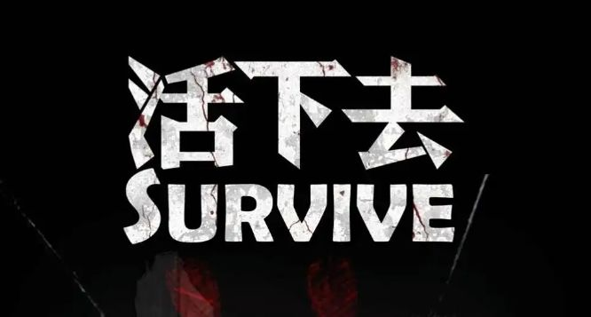
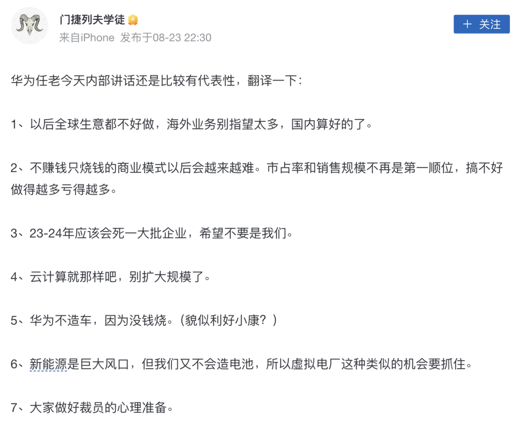
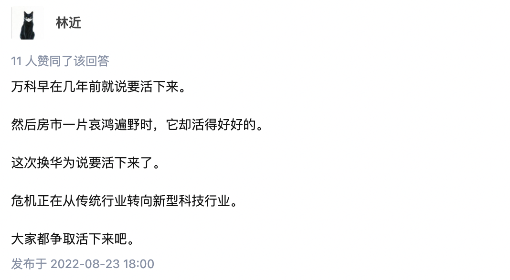
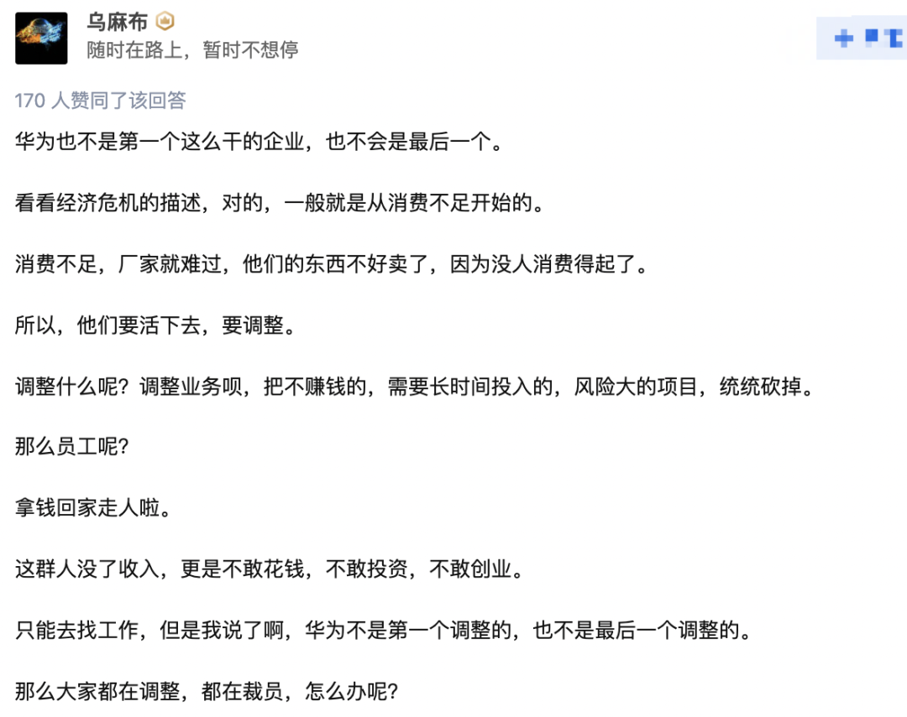

# 活下去
近日，任正非在华为内部发声：“全球经济将面临衰退、消费能力下降的情况，2023 年和 2024 年是华为的生命喘息期，未来整个公司的方针要从追求规模转向追求利润和现金流，把活下来作为最主要纲领。”

任正非在文内提到，全球经济将面临着衰退、消费能力下降的情况，华为应改变思路和经营方针，从追求规模转向追求利润和现金流，保证渡过未来三年的危机。“把活下来作为最主要纲领，边缘业务全线收缩和关闭，把寒气传递给每个人。”

“华为要把活下来作为主要纲领”话题在微博也冲上了热搜。

太长不看版1：网友基于“第一财经总结”的总结

太长不看版2：

第一财经对任正非文章的总结
未来三年有质量的活下去
我们‍‍要看到公司面临的困难以及未来的困难，未来十年应该是一个非常痛苦的历史时期，全球经济会持续衰退。现在由于战争的影响以及美国继续封锁打压的原因，全世界的经济在未来 3 到 5 年内都不可能转好，‍‍加上疫情影响，全球应该没有一个地区是亮点。那么消费能力会有很大幅度下降，‍‍对我们产生不仅是供应的压力，而且还有市场的压力。‍

在这样的情况下，华为对未来过于乐观的预期情绪要降下来，‍‍2023 年甚至到 2025 年，一定要把活下来作为最主要的纲领‍‍活下来，有质量的活下来，这个口号很好，每个业务都要去认真执行。‍‍‍

如果按计划在 2025 年我们会有一点点希望，那么我们要先想办法度过这三年艰难时期，‍‍生存基点要调整到以现金流和真实利润为中心，不能再仅以销售收入为目标。‍‍我们的生命喘息期就是 2023 年和 2024 年，这两年我们能不能突围，现在还不敢肯定，‍‍所以每个口都不要再讲故事，一定要讲实现，‍‍尤其在进行业务预判时，不要再抱幻想，讲故事骗公司，损失要从你们的粮食包中扣除，‍‍首先要活下来，活下来就有未来。‍

盲目投资的业务要收缩
2023 年预算要保持合理节奏，盲目扩张，盲目投资的业务要收缩或关闭。‍‍

全公司都要有效的使用预算，不能盲目一切将项目关闭，节约出来的人力压到前线去，‍‍继续优化机关业务，合理编制人员 ICT 基础设施，还是我们的黑土地粮仓，‍‍一定要收缩到一个有竞争力的复杂硬件平台与复杂软件平台，‍‍挂在上面搭车的项目都要摘出来。军团是建基础信息平台，‍‍更好的卖 ICT，基础设施卖底座不是做生态，终端是未来我们崛起突破的基础，但不能盲目。‍‍现在要缩小战线，集中兵力打歼灭战，提升盈利。‍

华为云计算要踏踏实实以支撑华为业务发展为主，走支持产业互联网的道路。‍‍数字能源在战略机会窗上加大投入，创造更大价值，收缩机关，加强作战队伍。智能汽车解决方案不能铺开一个完整战线，要减少科研预算，‍‍加强商业闭环，研发要走模块化的道路，‍‍聚焦在几个关键部件作出竞争力，剩余部分可以与别人连接。

除了为生存下来的连续性投资以及能够盈利的主要目标，‍‍未来几年内不能产生价值和利润的业务应该缩减或关闭，把人力物力集中到主航道来，‍‍我们要面对现实，不要有太遥远太伟大的理想，快刀斩乱麻，富余人员调整到战略预备队，‍‍再把它们组合到合理岗位上去抢粮食。‍

一定要把边缘业务从战略核心里抽出来。边缘业务抽出来以后，我们先评价一下能不能做好，‍‍还需要多少资源才能做好，做不好资源消耗巨大的业务不如关闭以后开放让别人去做，我们不要包打天下，‍‍如果确实是在战略管道里的，我们必须做，又做得不够好的就改组作战队伍换干部。‍‍如果出现了一些机会窗，我们扩大了战略预备队和干部专家战略资源池，‍‍组成突击队去机会窗突击。

坚持实事求是，在市场上的收缩要坚决。我们以前怀抱全球化理想，立志为全人类服务，‍‍现在我们的理想是什么？活下来，哪里有钱就在哪里赚一点。从这个角度出发，我们要在市场结构上调整，‍‍研究一下哪些地方可以做，哪些地方应该放弃。‍

放弃部分市场‍
第一，聚焦价值市场价值客户，‍‍把主要力量用于正态分布曲线中间的一段，一部分国家‍‍我们在市场上就彻底放弃了。我们也有肥肉市场，把原来啃骨头的人员调去啃肥肉。‍

第二，对于艰苦国家和地区，作为将来要提拔的新生干部的考核锻炼基地，‍‍有些国家产量少，我们虽然还要做，但是否不再派士兵守在雪山顶，因为下来后他还是士兵，‍‍雪山顶是考验人的，有潜力的新生干部下来就有机会升军长，因为小国容易综合化，‍‍他从概算预算、合同、投标交付、工时定额计算，解决方案一起干都做完了。‍‍回来在干部履历表上一天升将军 11 道门槛就过了 5 道 6 道。当然有些员工守边疆已经很长时间，‍‍回国收入减少，还涉及孩子上学问题，他自愿留在这些国家继续干，也不要强行调回国。‍

第三，海外回国的员工要优先获得技能培训和上岗机会。从海外归来的员工要有一个保护期，保护他在上岗，‍‍保证他获得一定的培训，艰苦国家的人员技能可能比国内差，因为他没有现实作战环境，怎么进步呢？‍‍就如高原上的士兵，虽然他站得很高，但并没有吸收什么宇宙能量，他们付出了代价，‍‍不能一回国就考试，然后就淘汰了，这样艰苦地区就没人愿意去，‍‍所以我们要保证回国员工有岗位安排，有宽松的学习时间，至于这段时间他的能力没有追赶上来就另当别论。‍

财务要做好现金流的规划，危难时期主要是要造血，‍‍我们虽说 2025 年会好转，但万一到时没有炮弹怎么办？所以那是美好的计划，我们要有安全的粮食措施。‍

公司有两大支出给员工分红，包括工资稳定，这是增强内部的信心和凝聚力，‍‍给银行还贷，这是增强社会对我们的信任度。‍‍‍‍已经存在较为明显的潜在风险的项目，不要再抱有幻想，要尽快浮出来，让审计做结论，将风险量化。与此同时依然可以继续管理这些已经被消除的资产，‍‍通过管理让风险变为适当的收益，我们心里不要带有一种泡沫幻想，一看报表挺好，决心就挺大，‍‍但到时实际赚不到钱。

让寒气传递到每个人
夯实责任，‍‍奖金升职升级与经营结果挂钩，将让寒气传递到每个人。‍‍

第一，在今年和明年的考核中要提升现金流和利润的权重，宁可销售收入下滑一些，但利润和现金流要增长，‍‍经营性利润增长的奖金要多一点，激励大家去争抢利润。‍‍

第二，各责任中心签署考核责任书，‍‍公司要针对基于 KPI 的对等奖赏机制，明年正常升职升级不变，‍‍但要加强与责任对等的挂钩，一年一年让人感觉到天冷，但我们的转换要有耐心热情，‍‍我曾给常务董事会讲过，基本工资框架不要变，这是一个刚性指标，‍‍但员工优秀了，可以升职升级，奖金可以有很大弹性。为什么有弹性？鼓励大家上战场抢粮食去，‍‍前线和机关不一样。‍‍

第三，今年各个业务的奖金一定要拉开差距，‍‍绝不允许平均逼迫大家实现抢粮食的短期目标。过去公司的政策是基本摆平，‍‍大家没有感觉到冬天的寒冷，每个人都盖被子，只是厚一点薄一点而已。‍‍今年年底利润和现金流多的业务，‍‍奖金就多发一些，不能创造价值的业务就是很低的奖金，甚至没有逼这个业务自杀，把寒气传递下去。‍‍

目前我们要活下来，不是为了理想而奋斗，‍‍军团比赛就是年底比奖金，因为奖金不是公司给的，是军团自己挣来的利润，而且还交给公司一部分，‍‍如果挣不到粮食，我们要敢于不发奖金，因为员工的基本收入可以开支生活必需品。‍‍当然有些战略业务短期内创造不出价值，我们可以通过评定的方式来确定，‍‍但很多业绩差的边缘业务一定要砍掉，这就是调整巩固充实提高。

生存危机点上不惜代价投入
质量是第一生产力，我们要坚持这样的路线，研发要对产品的质量和性能负责，并承诺‍‍服务专家要具有综合性能力，质量不好的产品是研发人员的耻辱，这句话应该贴到‍‍研发办公室的研发办公区的墙上，现在全世界‍‍网络故障率越来越高，一个事故就可能摧毁整个市场的信任体系。‍‍

100-1=0，对我们研发来说，‍‍单板的研发，单个器件的研发，系统的研发，一定要把质量放在首要，‍‍质量是研发制造人员对市场服务人员的最优支持保障。‍‍如果产品质量不好，就相当于让弟兄们冒着枪林弹雨，冰天雪地，炎热酷暑，新冠病毒在前线冲锋。‍‍所以我们要建立反向考核机制，一线反向考核不仅要考核机关服务组织，‍‍也要延伸到产品线，坐在办公室还做不好质量，那就要收缩战线，提高竞争力。‍

我们要提高服务体系的地位，服务专家对事故对网络体验要有综合判断能力。‍‍过去我们重研发轻服务，现在我们也要重视服务体系，要重视我们的网络不出问题，体验要好。‍‍合理科学合理的控制库存，我们要从过去恐慌性的自救改为有质量的自救，要注意合理的压库存，不要因为过大库存而造成公司的利润不足和现金流紧张，‍‍从而构成我们新的危机。在战略关键机会点上，生存危机点上，我们可以不惜代价投入，‍‍但在非战略机会点上不能乱花钱。‍

网友讨论

